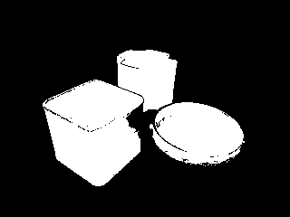

# Colour Based Object Detector 🎨


An object detection program in C that identifies and labels objects within bitmap images based on specified color profiles.

---

<details>
<summary>**Table of Contents**</summary>

1. [Project Overview](#project-overview)
2. [Installation](#installation)
3. [Usage](#usage)
4. [Features](#features)
5. [File Structure](#file-structure)
6. [Contact](#contact)

</details>

---

## Project Overview

This project is part of the MTRX1702 course and focuses on creating an object detector in C. The program scans bitmap images, detects regions based on predefined color thresholds, and applies depth-first search (DFS) to group connected pixels into objects.

---

## Installation

<details>
<summary>Click to expand</summary>

1. Clone the repository:
   ```bash
   git clone https://github.com/dylangeorg3/MTRX1702---Object-Detector.git
   ```

2. Navigate to the project directory:
   ```bash
   cd MTRX1702---Object-Detector
   ```

3. Compile the program:
   ```bash
   make
   ```
   or 
   ```bash
   make clean && make
   ```

5. Ensure any required image files or calibration data are correctly located as specified in the usage instructions.

</details>

---

## Usage

<details>
<summary>Click to expand</summary>

1. **Calibration Mode (c)**:
   - Run the calibration mode to generate color profile data for objects:
     ```bash
     ./cam_detect c object_name image_file
     ```
   - Example:
     ```bash
     ./cam_detect c orangeblock images/orangeblock.bmp
     ```

2. **Show Calibration Mode (s)**:
   - Display the contents of a calibration file:
     ```bash
     ./cam_detect s calibration_file
     ```
   - Example:
     ```bash
     ./cam_detect s calibration001.txt
     ```

3. **Detection Mode (d)**:
   - Detect objects based on a calibration file:
     ```bash
     ./cam_detect d calibration_file image_file
     ```
   - Example:
     ```bash
     ./cam_detect d calibration.txt images/combined002.bmp
     ```

4. **Writing Calibration Output to a File**:
   - To save calibration data to a file, use the following command:
     ```bash
     ./cam_detect c object_name image_file > calibration.txt
     ```
   - Example:
     ```bash
     ./cam_detect c orangeblock images/orangeblock.bmp > calibration.txt
     ```

   This command writes the calibration data directly to `calibration.txt`, which can be used later for detection mode.

### Example Outputs

- Calibration Mode Output:
  ```bash
  orangeblock 10 10 50 30
  ```

- Detection Mode Output:
  ```bash
  Detected orangeblock: 129 116 67 69
  Detected redblob: 77 15 114 110
  Detected greenblob: 29 25 29 21
  ```

Detected objects will be labeled and saved in the `output_images` folder.




</details>

---

## Features

<details>
<summary>Image Processing</summary>

- **Bitmap Parsing**: Reads and parses BMP file formats.
- **Calibration Data**: Utilizes a calibration file to define color thresholds for object detection.
- **Object Detection**: Identifies connected regions based on DFS algorithm.
- **Output**: Saves images with bounding boxes around detected objects to the `output_images` directory.

</details>

<details>
<summary>Error Handling</summary>

- **File Validation**: Checks for valid image and calibration files.
- **Input Errors**: Handles errors gracefully for missing files or incorrect arguments.

</details>

---

## File Structure

<details>
<summary>Click to expand</summary>

- **main.c**: Entry point of the object detector.
- **image.c / image.h**: Functions for reading and manipulating BMP images.
- **calibration.c / calibration.h**: Loads and processes color calibration data.
- **detection.c / detection.h**: Contains BFS and DFS algorithms for region detection.
- **output_images/**: Directory where labeled images are saved.
- **Makefile**: Compiles the project.

</details>

---

## Contact

Dylan George - [GitHub Profile](https://github.com/dylangeorg3)

Project Link: [https://github.com/dylangeorg3/MTRX1702---Object-Detector](https://github.com/dylangeorg3/MTRX1702---Object-Detector)
